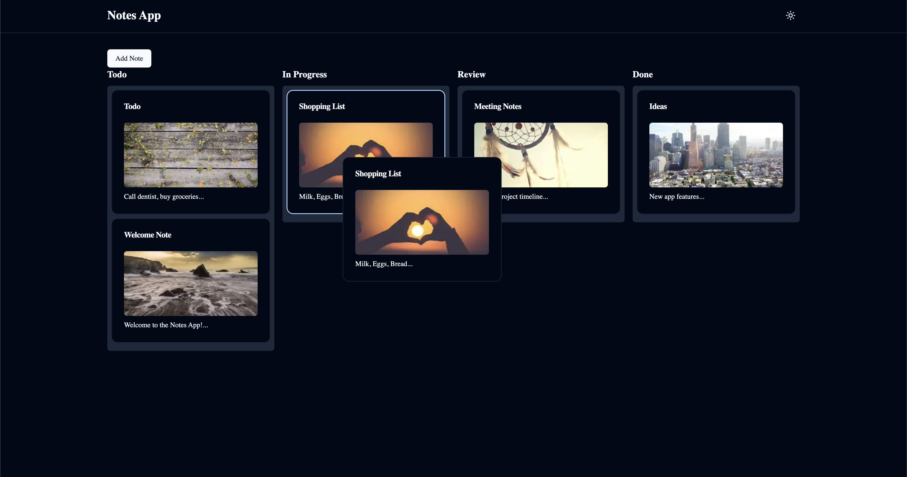

# Notes App

This is a [Next.js](https://nextjs.org/) project bootstrapped with [`create-next-app`](https://github.com/vercel/next.js/tree/canary/packages/create-next-app).

You can find the **prompt** for this app in the `.cursorrules` file in the root of this project.

## Demo App
You can find a demo of this app here https://notes-app-with-ai.vercel.app/

## YouTube Screencast Recording how I created this app
[Watch my recording on YouTube](https://youtu.be/5mzwwtVewSo)

## Benötigte Starteingaben im Terminal
```bash
npm install next -g

npx create-next-app@latest notes-app --typescript
cd notes-app

npm install @radix-ui/react-icons @radix-ui/react-slot @tanstack/react-query class-variance-authority clsx nuqs react-beautiful-dnd tailwind-merge tailwindcss-animate zod
npm install @dnd-kit/core @dnd-kit/sortable @dnd-kit/utilities
npm install -D @types/react-beautiful-dnd

npx shadcn@latest init
npx shadcn@latest add button input card dialog types select textarea
npm install next react react-dom @dnd-kit/core @dnd-kit/sortable @dnd-kit/utilities
npm install next-themes lucide-react tailwindcss-animate
```

## App Screenshot

[](https://www.youtube.com/watch?v=5mzwwtVewSo)

## About the App

This Kanban Notes App is a dynamic, interactive task management system built with Next.js, React, and TypeScript. It features:

- A Kanban-style board with four columns: Todo, In Progress, Review, and Done
- Drag-and-drop functionality for moving notes between columns
- Ability to add new notes with a title, content, and initial status
- Random images assigned to each note for visual interest
- Responsive design with a dark/light mode toggle

Additional features include:
- A list of all notes
- A detail page for each note
- An edit page for each note
- A delete button for each note
- A search field for the list of notes
- A filter field for the list of notes
- A sort field for the list of notes
- Pagination for the list of notes
- Loading state for the list of notes
- Error state for the list of notes

## Technology Stack

- TypeScript for type-safe code
- Next.js App Router for efficient routing
- React for building user interfaces
- Shadcn UI and Radix UI for component design
- Tailwind CSS for styling and responsive design

## Code Style and Structure

- Functional and declarative programming patterns
- Modular code structure
- Descriptive variable naming
- TypeScript interfaces for type definitions
- React Server Components (RSC) for improved performance
- URL search parameter state management with 'nuqs'

## Getting Started

1. Clone the repository to your local machine.

2. Install the dependencies:

```bash
npm install
```

```bash
npm run dev
```

Open [http://localhost:3000](http://localhost:3000) with your browser to see the result.

You can start editing the page by modifying `app/page.tsx`. The page auto-updates as you edit the file.

This project uses [`next/font`](https://nextjs.org/docs/basic-features/font-optimization) to automatically optimize and load Inter, a custom Google Font.

## Learn More

To learn more about Next.js, take a look at the following resources:

- [Next.js Documentation](https://nextjs.org/docs) - learn about Next.js features and API.
- [Learn Next.js](https://nextjs.org/learn) - an interactive Next.js tutorial.

You can check out [the Next.js GitHub repository](https://github.com/vercel/next.js/) - your feedback and contributions are welcome!

## Deploy on Vercel

The easiest way to deploy your Next.js app is to use the [Vercel Platform](https://vercel.com/new?utm_medium=default-template&filter=next.js&utm_source=create-next-app&utm_campaign=create-next-app-readme) from the creators of Next.js.

Check out our [Next.js deployment documentation](https://nextjs.org/docs/deployment) for more details.
